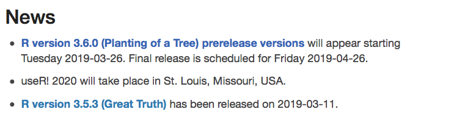
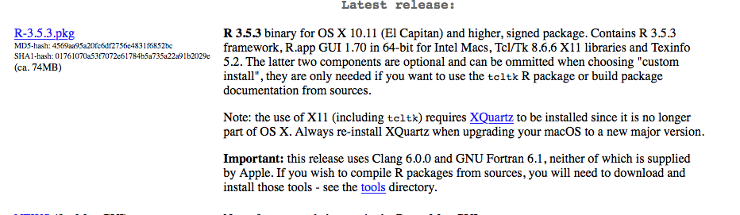
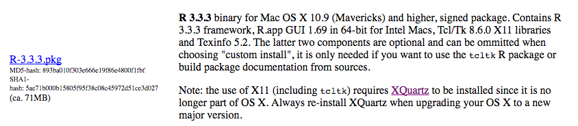
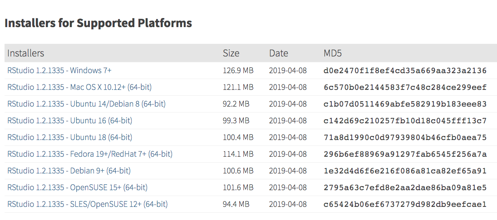
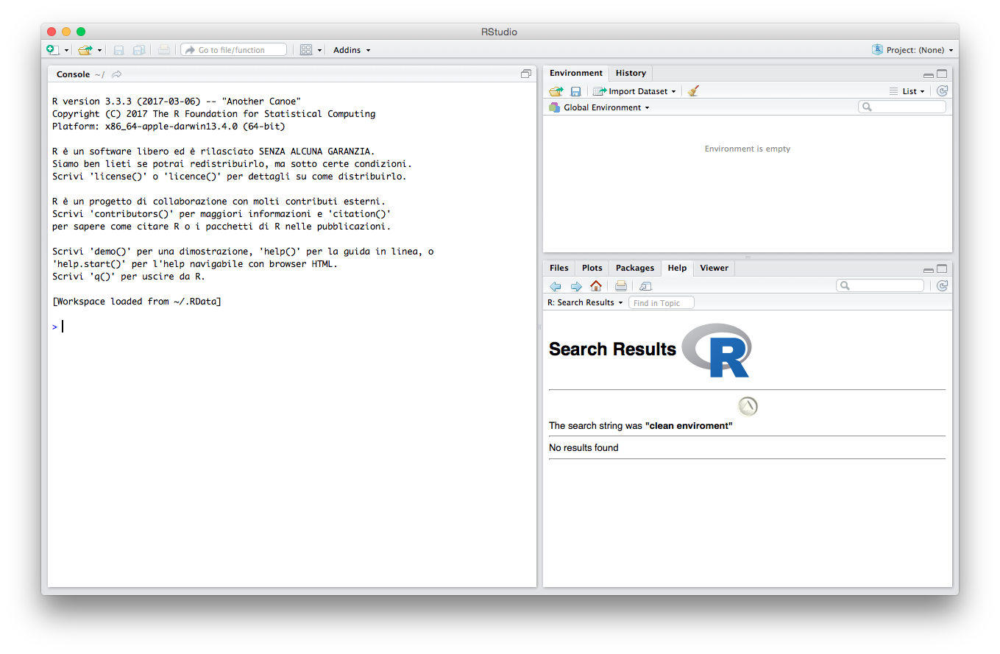
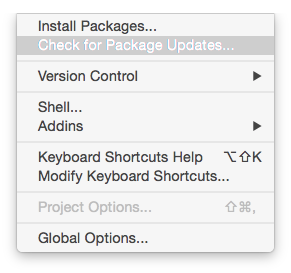
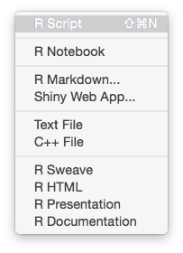

# Primi passi con R


In questa prima parte vedremo quali sono i passi base per istallare R e Rstudio sul nostro computer. 


## Perché R

> R is a free software environment for statistical computing and graphics. 
> It compiles and runs on a wide variety of UNIX platforms, Windows and MacOS. 
> 
> <cite> The R Foundation <cite>


R è un versatile linguaggio di programmazione che sta particolarmente a cuore alla comunità che si occupa di statistica, per questo esistono molte pagine volte ad insegnarne l'uso, così come molti blog e forum dove gli utenti possono cercare risposte alle loro domande realtive all'uso.

R è un software libero disponibile per le maggiori piattaforme, inclusi Windows, Mac e diverse distribuzioni di Linux. 

Per esempio, possiamo trovare molte guide su come installare R sul nostro computer Windows, Mac o Linux. Una semplice ricerca su google produce innumerevoli guide e tutorial su come farlo. 


Noi seguiremo una via molto diretta che segue due passi fondamentali: 

* l'istallazione di R vera e propria;
* l'istallazione di un interfaccia. 
 
Installeremo la [versione] (https://www.r-project.org/) di R rilasciata l'11/03/2019 e tra le innumerevoli interfacce per R, noi useremo [R Studio](https://www.rstudio.com/products/rstudio/). Si noti che tra pochi giorni sarà disponibile la versione 3.6.0.



## Installare R

Procediamo con l'istallazione di R

### Scaricare R

Le varie release di R sono disponibili attraverso il sito [cran](https://cran.r-project.org/), dove è possibilie selezionare il server più vicino da cui fare il download dei file di istallazione. 

Ad esempio possiamo scegliere il server relativo all'[Università di Padova](https://cran.stat.unipd.it/). Da qui troviamo i link per scaricare le release di R per le varie piattaforme.

<!--  -->


R è un progetto open source, quindi oltre agli installer è possibile scaricare il codice sorgente di R, ed è possibile apportare modifiche e/o compilarlo personalmente. 

Noi scaricheremo invece l'applicazione relativa al vostro sistema operativo  (nelle immagine Mac) e procederemo con l'installazione. 

La pagina di download permette di scaricare anche versioni meno recenti di R. 
Questo può essere importante qualora si usino delle estensioni (chiamate ***pacchetti***), che potrebbero non essere state aggiornate per l'ultima versione. Noi considereremo per questo tutorial l'istallazione della versione 3.5.3.



Si noti che l'istallazione su Mac richiede l'istallazione di [XQuartz](https://www.xquartz.org/)

Alcuni computer meno aggiornati potrebbero non supportare la versione più recente (tipo il mio). In tal caso, si consiglia l'istallazione della versione 3.3.3.



Nel caso in cui si stesse installando R sulla distribuzione linux Ubuntu, è possibile farlo da terminale attraverso i comandi:
```bash
sudo apt-get update
sudo apt-get install r-base
```
Il sito descrive la procedura anche per le altre distribuzioni.

## Installare R

Nell'istallazione su Mac o Windows si segue la procedura standard una volta scaricati i file.
Per installare R su linux, basta usare i comandi descritti precedentemente per Ubuntu, o utilizzare gli equivalenti per le altre distribuzioni.

## Usare R

Una volta istallato R, è già possibile usarne tutte le funzionalità. Infatti andando in **Applicazioni** si può già trovare R tra esse. Pigiando la relativa icona si avvia la **R console**, una interfaccia molto semplice che però permette di usufruire di __tutte__ le potenzialità del software.


Ad esempio digitando 

```{r}
2+2
```


oppure

```{r}
3*5
```
è possibile utilizzare la console come calcolatrice. Ovviamente questo tipo di uso sfrutta solo una minima parte delle potenzialità del software.

Sebbene tutto quello che faremo sarà possibile farlo anche direttamente da console, noi useremo un software che si interfaccia ad R, ma che presenta un'interfaccia grafica più completa. Tale programma è [R Studio](https://www.rstudio.com/products/rstudio/).

## Installare R Studio

Come R, anche R Studio è disponibile gratuitamente per utenti singoli, anche se sono previste anche versioni commerciali a pagamento. Inoltre è possibile [scaricare](https://www.rstudio.com/products/rstudio/download2/) pacchetti di installazione sia per Windows, Mac e alcune distribuzioni di Linux. 



Una volta scaricati i pacchetti di installazione, la procedura automatica dovrebbe installare R Studio per tutte le piattaforme (speriamo!).

## Usare R Studio

Una volta installato R Studio, avviamolo e (se l'istallazione è andata a buon fine) dovrebbe apparire la schermata iniziale:



L'interfaccia grafica si presenta con 3 principali finestre che riportano la console di R (la stessa che abbiamo visto prima singolarmente), la finestra **Enviroment** e **History** e quella contenente **Files**, **Plots**, **Packages**, **Help** e **Viewer**.

Per prima cosa controlliamo che tutti i pacchetti contenuti nell'installazione siano aggiornati. Selezionando da Tools:



Se risultano pacchetti da aggiornare, selezionateli tutti e aggiornateli. In caso non vi siano, R Studio vi dovrebbe avvisare.

### Cartelle

E' possibile usare degli appositi comandi per capire in quale cartella sta lavorando R. Questo è essenziale se si vuole salvare dei file o leggerne il contenuto.

```{r}
getwd()
```
Questo comando *get working directory* restituisce il path della cartella corrente. R può facilmente leggere o salvare file in questa cartella.

E' possibile impostare una cartella diversa. Ad esempio possiamo creare una cartella relativa al corso di **Calcolo delle probabilità e statistica matematica (CPeSM)** e possiamo creare lì dentro una cartella chiamata R, dove possiamo salvare i nostri file. 

```{r, eval=FALSE}
setwd('IL-Vostro-path/CPeSM/R/Lezione1')
```


Una volta capito dove siamo e dove dovremmo essere, possiamo iniziare ad usare una delle funzionalità per cui abbiamo scelto R Studio: la possibilità di creare degli script nella stessa interfaccia grafica e di lanciare comandi dagli stessi.

Selezioniamo **File|New File|R Script** apriamo in R Studio una nuova finestra che permette di editare (scrivere) uno script.




Ora non rimane che spendere un po' di tempo a familiarizzare con l'interfaccia e con R!

## Link utili
- A questo [link](https://cran.r-project.org/doc/contrib/Mineo-dispensaR.pdf) è possibile reperire delle utili dispense sull'uso di R.
- A questo [link](https://cran.r-project.org/doc/contrib/Frascati-FormularioStatisticaR.pdf) è possibile reperire un utile formulario che descrive moltissimi comandi di R.
<!-- - A questo [link](http://tryr.codeschool.com/) è possibile seguire un veloce tutorial che introduce molti dei comandi di base di R (in inglese). -->

<!-- Figures and tables with captions will be placed in `figure` and `table` environments, respectively. -->

<!-- ```{r nice-fig, fig.cap='Here is a nice figure!', out.width='80%', fig.asp=.75, fig.align='center'} -->
<!-- par(mar = c(4, 4, .1, .1)) -->
<!-- plot(pressure, type = 'b', pch = 19) -->
<!-- ``` -->

<!-- Reference a figure by its code chunk label with the `fig:` prefix, e.g., see Figure \@ref(fig:nice-fig). Similarly, you can reference tables generated from `knitr::kable()`, e.g., see Table \@ref(tab:nice-tab). -->

<!-- ```{r nice-tab, tidy=FALSE} -->
<!-- knitr::kable( -->
<!--   head(iris, 20), caption = 'Here is a nice table!', -->
<!--   booktabs = TRUE -->
<!-- ) -->
<!-- ``` -->

<!-- You can write citations, too. For example, we are using the **bookdown** package [@R-bookdown] in this sample book, which was built on top of R Markdown and **knitr** [@xie2015]. -->
